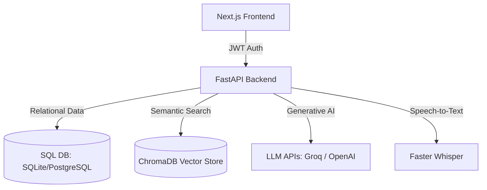

<div align="center">
  
  <h1>CareerForge AI 🚀</h1>
  <p><strong>Your Ultimate AI-Powered Career Coach & Job Application Strategist</strong></p>

  <p>
    <a href="https://fastapi.tiangolo.com/"></a>
    <a href="https://nextjs.org/"></a>
    <a href="https://www.postgresql.org/"></a>
    <a href="https://docs.pytest.org/en/stable/"></a>
    <a href="https://github.com/features/actions"></a>
  </p>
</div>

---

## 🌟 Overview

CareerForge AI is a comprehensive, AI-powered career coaching platform designed to give job seekers a competitive edge. By combining modern web technologies with advanced Artificial Intelligence, CareerForge AI automates and optimizes the job application process.

### Core Features:
- 📄 **Resume Optimization:** Tailor your resume to specific Job Descriptions using a hybrid SQL + Vector (ChromaDB) retrieval system.
- 🎯 **ATS Scoring Engine:** A transparent, explainable 3-layer scoring system (Rules + Semantic + LLM).
- 📝 **Cover Letter Generation:** Generate highly relevant, contextual cover letters instantly.
- 📊 **Application Tracking System:** Track your job applications, statuses, and progression over time.
- 🎙️ **Mock Interviews:** Real-time AI interview practice with speech-to-text using OpenAI Whisper.

---

## 🏛️ Architecture



### Why a Hybrid Database Approach?

CareerForge uses both Relational (SQL) and Vector databases to ensure data integrity while enabling semantic intelligence.

| Storage System | Primary Responsibility | Interview & Scale Relevance |
|----------------|------------------------|-----------------------------|
| **SQL (SQLAlchemy)** | Users, Auth, Resumes Metadata, Applications, ATS scores | ACID transactions, strict multi-tenant isolation via `user_id`, scalable indexing. |
| **ChromaDB (Vector)** | Chunked resume embeddings for semantic search | Fast ANN retrieval. Answers: _“Which resume bullets best match this JD?”_ without full-table scans. |

---

## 🛠️ Tech Stack

- **Frontend:** Next.js (App Router), React, Tailwind CSS, Lucide Icons
- **Backend:** FastAPI, Python 3.11+, SQLAlchemy 2.0, Alembic
- **Databases:** SQLite (Development) / PostgreSQL (Production), ChromaDB (Persistent Vector Store)
- **AI & NLP:** LangChain, Groq API (LLaMA/Mixtral), OpenAI Whisper (Speech-to-Text), PyMuPDF (PDF Parsing)
- **DevOps:** GitHub Actions (CI/CD), Pytest, Ruff (Linting & Formatting)

---

## 🧠 Explainable ATS Scoring (3-Layer Hybrid Model)

Our Applicant Tracking System (ATS) scoring isn't just a hallucinated percentage from an LLM. It is highly structured and explainable:

| Layer | Type | Max Score | Evaluation Criteria |
|-------|------|-----------|---------------------|
| **1. Rule-Based** | Deterministic | 55 | Keywords, sections, quantifiable metrics, action verbs, resume length. |
| **2. Semantic** | Vector Search | 25 | Cosine similarity between chunked resume embeddings and the Job Description. |
| **3. LLM Qualitative**| Generative AI | 20 | Bounded qualitative fit assessment, providing strengths & improvement narrative. |

---

## 🚀 Quick Start (Local Development)

### Prerequisites
- Python 3.11+
- Node.js 18+
- API Keys: [Groq](https://console.groq.com/) (Required) and [OpenAI](https://platform.openai.com/) (Optional, for advanced STT)

### 1. Backend Setup

```bash
# Clone the repository
git clone https://github.com/akshay2004m/careerforge.git
cd careerforge/backend

# Create and activate virtual environment (Windows)
python -m venv venv
.\venv\Scripts\activate

# Install dependencies
pip install -r requirements.txt

# Configure environment variables
cp .env.example .env
# Edit .env and add your GROQ_API_KEY & SECRET_KEY

# Run database migrations
alembic upgrade head

# Start the FastAPI server
uvicorn app.main:app --reload --port 8000
```
- **API Docs:** [http://127.0.0.1:8000/docs](http://127.0.0.1:8000/docs)
- **Health Check:** [http://127.0.0.1:8000/health](http://127.0.0.1:8000/health)

### 2. Frontend Setup

```bash
cd ../frontend

# Install dependencies
npm install

# Configure environment variables
cp .env.example .env.local
# Set NEXT_PUBLIC_API_URL=http://127.0.0.1:8000

# Start the Next.js development server
npm run dev
```
- **Web App:** [http://localhost:3000](http://localhost:3000)

---

## 🧪 Testing & CI/CD

The project utilizes `pytest` with extensive coverage for core logic (like ATS analysis and document parsing), integrated with **GitHub Actions** for continuous integration.

```bash
cd backend
pytest tests/ -v
```

---

## ☁️ Deployment Strategy (Recommended)

To deploy CareerForge AI to production, we recommend the following split architecture to maximize performance while minimizing costs:

1. **Frontend (Vercel):** Seamless Next.js edge deployment and global CDN.
2. **Backend (Render / Railway):** Reliable hosting for the FastAPI Python backend.
3. **Database (Neon Serverless Postgres):** Scalable, production-ready PostgreSQL with a generous free tier.
4. **Vector Store:** Migrate from local ChromaDB to a managed vector database (like Pinecone) or leverage `pgvector` alongside Neon.

---

## 🔒 Security Best Practices Implemented

- **Password Storage:** bcrypt hashing (cost factor 12).
- **Authentication:** Stateless JWT Bearer tokens with strict expiration.
- **Data Isolation:** All database queries and vector searches are strictly isolated by `user_id`.
- **Upload Hygiene:** Secure PDF magic-byte validation, file size limits, and sanitized filenames to prevent path traversal.
- **API Protection:** CORS allow-listing and dependency-injected security guards.

---

<div align="center">
  <p>Built with ❤️ for modern software engineers aiming to land their dream roles.</p>
</div>
